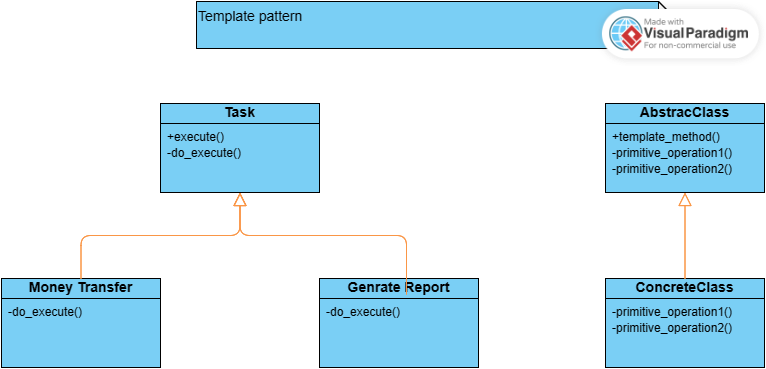

# Design-Patterns

### <a href="#memento">1-Memento Pattern </a>

### <a href="#state">2-State Pattern </a>

### <a href="#iterator">3-Iterator Pattern </a>

### <a href="#strategy">4-Strategy Pattern </a>

### <a href="#template">5-Template Pattern </a>

### <a href="#command">6-Command Pattern </a>


# <a id="memento">Memento Pattern</a>


The main purpose of this model is to implement the undo mechanism like in editors and ...
for doing this purpose we have 3 class one is editor that is our main class you can assume it as a real editor
that can we write content on it.
another class is editor state that modeling editor attributes and the other one is history class that is responsible for saving and keeping editor diffrent state
```python
from dataclasses import dataclass


@dataclass
class EditorState:
    content: str
    font: str
    font_size: int


class Editor:
    def __init__(self):
        self._content: str = ''
        self._font: str = ''
        self._font_size: int = 0

    def create_state(self) -> EditorState:
        return EditorState(self.content, self.font, self.font_size)

    def restore_state(self, state: EditorState):
        self.content = state.content
        self.font = state.font
        self.font_size = self.font_size

    def set_content(self, content: str, font: str = 'default', font_size: int = 12):
        self.content = content
        self.font = font
        self.font_size = font_size

    def get_content(self) -> tuple:
        return (self.content, self.font, self.font_size)


class EditorHistory:
    def __init__(self) -> None:
        self.state: list = []

    def pushHistory(self, state: EditorState):
        self.state.append(state)

    def popHistory(self) -> EditorState:
        last_state = self.state.pop()
        return last_state


if __name__ == '__main__':
    editor = Editor()
    history = EditorHistory()

    editor.set_content('first content')
    history.pushHistory(editor.create_state())

    editor.set_content('second content')
    history.pushHistory(editor.create_state())

    editor.set_content('third content')
    editor.restore_state(history.popHistory())
    print(editor.get_content())
```
## note

you may ask a quesion why we dont implement all these on editor class the answer is simple because of single responsibility in SOLID priciple, that says a class only should have one and only one reason to change

# <a id="state">State Pattern</a>


this design pattern is use when we have an entity that constatntly changes to diffrerent states like a paint application which we can change our selection tool to brush , selection, rectangle , circle , ....

we can implemnt this by using << if statements >> and get the state value from input and check what state our client need and get some action base on that state we got.

this is simple solution but what if we want to add more and more state during our app development?
we should constantly change our class and add more if else statement. this violate open close principle that say a class should open for execution and close to modification.

## solution

we can get some hand from state pattern in here base on the digram.
we have multiple class, first one is canvas, another is Tool that have two abstract methods and the brush and selection class that inherit from Tool class
as you can see we create canvas instance and set the tool to Selection instance and call the mouseDown and mouseUp event
```python
from abc import abstractmethod, ABC

# State
class Tool(ABC):
    # handler1
    @abstractmethod
    def mouse_down(self):
        pass

    # handler2
    @abstractmethod
    def mouse_up(self):
        pass


# Context
class Canvas:
    def __init__(self) -> None:
        self._curent_tool: Tool

    @property
    def tool(self):
        return self._curent_tool

    @tool.setter
    def tool(self, value):
        self._curent_tool = value

    # request1
    def mouse_down(self):
        self._curent_tool.mouse_down()

    # request2
    def mouse_up(self):
        self._curent_tool.mouse_up()


# Selection1
class Selection(Tool):
    # handler
    def mouse_down(self):
        print("changing icon to selection")
    # handler

    def mouse_up(self):
        print("draw a line")


# Selection2
class Brush(Tool):
    # handler
    def mouse_down(self):
        print("changing icon to brush")

    # handler
    def mouse_up(self):
        print("brushing")

# we can also add as many class as we want


if __name__ == "__main__":
    canvas=Canvas()
    canvas.tool=Selection()
    canvas.mouse_down()
    canvas.mouse_up()
```
## note

you can add as many tools by this pattern by adding a new class

##practice
think what is other scenarios exist that we should use state pattern.
also try to add another paint tool to this pattern

# <a id="iterator">Iterator Pattern</a>


iterator pattern used when we want to store some value as history or any thing else But it is possible to change our data structure to store the desired data in the future.

for example in iterator.py what we do is saving and controling browsing history in a list but it is possible that we change it to tuple or dictinary or it is possible that we want a fixed array

here the problem is when we want to write this code in normal way, in future if we want to change our desired data structure to something else it is hard to do refactoring in our code, because we should chanage all consumers that use BorwsHistory class

## solution

so what we do is to create an iterator class that is responsible for iterating the used data structure and all consumers instead of using data structor operators using Iterator class to get access to data, in future if we want to change our data structure only we should apply some change to iterator and history class

in example code, we have three class one is Iterator that is abstrac and we used it only as an interface, the other one is BrowsHistory class that responsible for pushing and poping data and keeping our desired data structure, another one is ListIterator inner class that inherit from Iterator class

when consumers want to add or delete some data they use push & pop mehtod and when they want to iterate over history they call create_itrator class and get a itrable instance from desired data structure and they can itrate throw data by calling next & prev & current & has_next method

```python
from abc import ABC, abstractmethod


class Iterator(ABC):
    @abstractmethod
    def current(self) -> str:
        pass

    @abstractmethod
    def next(self):
        pass

    @abstractmethod
    def prev(self):
        pass

    @abstractmethod
    def has_next(self) -> bool:
        pass


class BrowsHistory:
    def __init__(self) -> None:
        self.uri_list = []

    def push(self, value: str):
        self.uri_list.append(value)

    def pop(self) -> str:
        return self.uri_list.pop()

    def create_itrator(self) -> 'BrowsHistory.ListIterator':
        return self.ListIterator(self)

    class ListIterator(Iterator):
        def __init__(self, history) -> None:
            self.history = history
            self.index = 0

        def current(self) -> str:
            return self.history.uri_list[self.index]

        def next(self):
            self.index += 1
            return self.history.uri_list[self.index]

        def prev(self):
            self.index -= 1
            return self.history.uri_list[self.index]

        def has_next(self) -> bool:
            try:
                self.history.uri_list[self.index+1]
                return True
            except IndexError:
                return False


if __name__ == '__main__':
    history = BrowsHistory()
    history.push('a')
    history.push('b')
    history.push('c')
    history.push('d')
    itr = history.create_itrator()

    while(itr.has_next()):
        print(itr.current())
        itr.next()
    
    itr.prev()
    itr.prev()
    itr.prev()
    print(itr.current())
```
## note

in future if we change our datastructure to Array we only need some changing in BrowsHistory and ListItrator class

# <a id="strategy">Strategy Pattern</a>


let's assume that we have an Image Storage class and we want apply some filter and also change commpress format base by client requirements like appllying some Black&White filter or HighContast and compressing image to Png Jpeg or any thing else

if we want to solve this in simple and easy way we can use some if else statement that check waht type or what filter client need and base on that applying them on image

## solution

this solution violate single responsibility & open close principle for solving this we create two interface name Compressor and Filter that have compress and apply mehtod. after that we can add png class that overide compress mehtod and WBFilter class that overide apply method.
```python
from abc import ABC, abstractmethod


class Compresor(ABC):
    @abstractmethod
    def compress(self, image):
        pass


class PngCompresor(Compresor):
    def compress(self, image):
        print('compressing to png')


class JpegCompressor(Compresor):
    def compress(self, image):
        print('compressing to Jpeg')


class Filter(ABC):
    @abstractmethod
    def apply(self, image):
        pass


class WbFilter(Filter):
    def apply(self, image):
        print('wb filter set on image')


class HighContrastFilter(Filter):
    def apply(self, image):
        print('High comress set on image')


class ImageStorage:
    def save(self, image, filtering: Filter, compressor: Compresor):
        compressor.compress(image)
        filtering.apply(image)
        print('image saved')


if __name__ == '__main__':
    storage = ImageStorage()
    storage.save('image file', HighContrastFilter(), PngCompresor())
```
## note

if we want to add more compress format like Jpeg we jus need creating new class and overide the compress method base by Compressor format and likewise for adding new Filter

# <a id="template">Template Pattern</a>



let assume that we have banking app and before any opertion we should call some AuditTrail action(An audit trail is a chronological record of all activities and actions taken within a software application or system. It provides a summary of who did what,) so for implementing this you might be thinking as we create one class for each action and also a auditTrail class with record method and calling audit trail in each class

## problem

one probem is we must repeat calling this function in each class and the other is when we implement our class structure we must assure that AuditTrail will be Called before in each operation in new sub classes

## solution

for solving this we can use strategy pattern in previous section or the template pattern taht we explain here
in template pattern we create an abstrac class named Task and in Task contructor we pass a instance of AuditTrail class. after that we create two method one is execute that will be execute the audittail and do_execute method. the  do_execute method is an abstract and protected method and will be overrided in child classes. 
now we can inherit from Task class, for example create a Transfer money class that inherit from Task and override the do execute method,now what happens is the client can not directly access to this do_execute method because it is protected, he must use execute method and when using it we can assure that the audit_trail operation will be executed before each task

```python
from abc import ABC, abstractmethod


class AuditTrail:
    def record(self):
        print('audited')


class Task(ABC):
    def __init__(self) -> None:
        self._audit_trail = AuditTrail()

    def execute(self):
        self._audit_trail.record()
        self._do_execute()

    @abstractmethod
    def _do_execute(self):
        pass


class MoneyTransfer(Task):
    def _do_execute(self):
        print('money transfered')


class GenerateReport(Task):
    def _do_execute(self):
        print('report genrated')


if __name__ == '__main__':
    MoneyTransfer().execute()

```

## note

we can have as many mehtod like do_execute that we calling them primitive method in ttemplate pattern


# <a id="command">Command Pattern</a>

we can use command pattern in tree senarios:

1- when we have a service and event  and they should communicate to each other:
    command pattern will be used as some broker for passing data from service to event 

2- when we have an app that can run commposite command (multi command selection and execution)

3- for implementing undo mechanism when saving data will be const exepensive and we should implement undo mechnis throw a reverse process

## solution
all of the command pattern problem we mentioned have a ABC class named Command and this class have a execute method 


## Solving problem 1

 we can solve problem1 with 2 class first of all we have Button class act as event and a CustomerService act as service. we create new class named CustomerAddCommand that inherit from Command class and pass CustomerService class ti it's constructor. inside execute method we call add_customer function inorder ro handle add functionallity. so after this, first we create a CustomerService class instance and pass it to instance of CustomerAddCommand and we also pass this command to Button class. in Button class we have click method that trigger the click functionallity we call it and new customer will be added base bu detail we provided
```python
from abc import abstractmethod, ABC


class Command(ABC):
    
    @abstractmethod
    def execute(self):
        pass


class Button:
    def __init__(self, command) -> None:
        self.command = command

    def click(self):
        self.command.execute()


class UserService:
    def add_user(self):
        print('user added')

class UserAddCommand(Command,UserService):

    def add_user(self):
        return super().add_user()
    
    def execute(self):
        self.add_user()
        return super().execute()
    
if __name__=="__main__":
    service=UserService()
    command=UserAddCommand()
    button=Button(command)
    button.click()
```


## Solving problem 2

 for problem 2 we just add a as many command class we need  and also create a COmposite class that have command_list array and and add fnction that get a command and add to list. in execute method we use a for loop and execute all command. so if we add our commands instance to composite class and call the execute method all command will be executed

```python
from abc import ABC, abstractmethod


class Command(ABC):

    @abstractmethod
    def execute(self):
        pass


class WBFilter(Command):

    def execute(self):
        print('WbFillter applied')


class HighContrast(Command):
    def execute(self):
        print('High contrast filter')


class Composite(Command):

    def __init__(self) -> None:
        self.commands: list[Command] = []

    def add(self, command: Command):
        self.commands.append(command)

    def execute(self):
        for command in self.commands:
            command.execute()


if __name__ == "__main__":
    compoite = Composite()
    compoite.add(HighContrast())
    compoite.add(WBFilter())
    compoite.execute()
```


## Solving problem 3

for problem 3, undo mechnism we have Command class and UndoableCommand that inherit from Command, also havwe history class for saving commands also have a HtmlDocument and BoldCommand inherited from Undoable and have a prevContent attr, these are our main classes we want to do undo, also we must add an undo class. for using these pattern we create instance from Html Document and Bold Command and call execte method the will use Bold Command of HtmlDoc and make Docs contents Bold in execute method also we set prevContent atter value and add present instance of BoldCommand to History(when we create an instance from Bold we must pass Doc & History class to its constructor). at last we just need an instance of Undo class and passing history to this instance. when we call undo function. the history.pop() will be called and the result is a UndobleCommand object that we can also call unexecute this obejct. this will automatically undo the content of the document.

```python
from abc import ABC, abstractmethod


class Command(ABC):

    @abstractmethod
    def execute(self):
        pass


class UndoableCommand(Command):

    @abstractmethod
    def unexecute(self):
        pass


class HtmlDocument:
    def __init__(self) -> None:
        self._content: str = ''

    @property
    def content(self) -> str:
        return self._content

    @content.setter
    def content(self, value):
        self._content = value

    def bold_content(self):
        self._content = '<b>'+self.content+'</b>'


class History:
    def __init__(self) -> None:
        self.history_list: list[UndoableCommand] = []

    def push(self, command: Command):
        self.history_list.append(command)

    def pop(self) -> UndoableCommand:
        return self.history_list.pop()


class BoldCommand(UndoableCommand):
    def __init__(self, document: HtmlDocument, history) -> None:
        self.document = document
        self.prev_content: str = ''
        self.history = history

    def unexecute(self):
        self.document.content = self.prev_content

    def execute(self):
        self.prev_content = self.document.content
        self.document.bold_content()
        self.history.push(self)


class UndoCommand(Command):

    def __init__(self, history: History) -> None:
        self.history = history

    def execute(self):
        command = self.history.pop()
        command.unexecute()


if __name__ == "__main__":
    document = HtmlDocument()
    document.content="hello world!!!"
    history = History()
    command = BoldCommand(document, history)
    command.execute()

    print(document.content)

    undo_command=UndoCommand(history)
    undo_command.execute()

    print(document.content)
```
