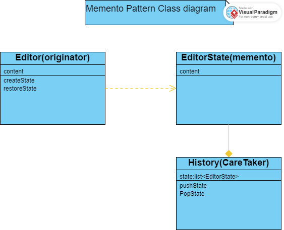
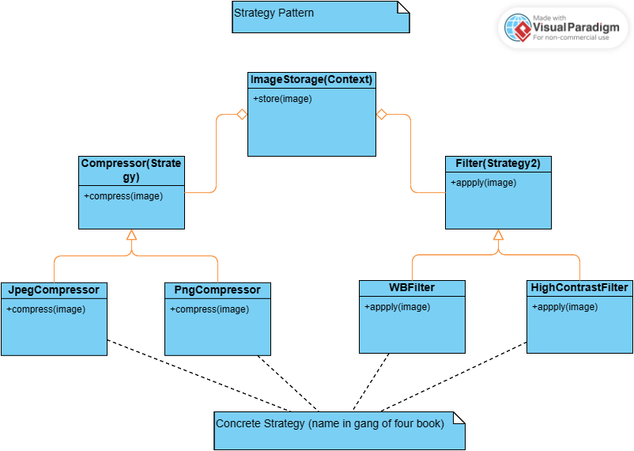

# Design-Patterns

### <a href="#memento">1-Memento Pattern </a>

### <a href="#state">2-State Pattern </a>

### <a href="#iterator">3-Iterator Pattern </a>

### <a href="#strategy">4-Strategy Pattern </a>

### <a href="#template">5-Template Pattern </a>

### <a href="#command">6-Command Pattern </a>

# <a id="memento">Memento Pattern</a>

The main purpose of this model is to implement the undo mechanism like in editors and ...
for doing this purpose we have 3 class one is editor that is our main class you can assume it as a real editor
that can we write content on it.
another class is editor state that modeling editor attributes and the other one is history class that is responsible for saving and keeping editor diffrent state

## note

you may ask a quesion why we dont implement all these on editor class the answer is simple because of single responsibility in SOLID priciple, that says a class only should have one and only one reason to change

# <a id="state">State Pattern</a>

this design pattern is use when we have an entity that constatntly changes to diffrerent states like a paint application which we can change our selection tool to brush , selection, rectangle , circle , ....

we can implemnt this by using << if statements >> and get the state value from input and check what state our client need and get some action base on that state we got.

this is simple solution but what if we want to add more and more state during our app development?
we should constantly change our class and add more if else statement. this violate open close principle that say a class should open for execution and close to modification.

## solution

we can get some hand from state pattern in here base on the digram.
we have multiple class, first one is canvas, another is Tool that have two abstract methods and the brush and selection class that inherit from Tool class
as you can see we create canvas instance and set the tool to Selection instance and call the mouseDown and mouseUp event

## note

you can add as many tools by this pattern by adding a new class

##practice
think what is other scenarios exist that we should use state pattern.
also try to add another paint tool to this pattern

# <a id="iterator">Iterator Pattern</a>

iterator pattern used when we want to store some value as history or any thing else But it is possible to change our data structure to store the desired data in the future.

for example in iterator.py what we do is saving and controling browsing history in a list but it is possible that we change it to tuple or dictinary or it is possible that we want a fixed array

here the problem is when we want to write this code in normal way, in future if we want to change our desired data structure to something else it is hard to do refactoring in our code, because we should chanage all consumers that use BorwsHistory class

## solution

so what we do is to create an iterator class that is responsible for iterating the used data structure and all consumers instead of using data structor operators using Iterator class to get access to data, in future if we want to change our data structure only we should apply some change to iterator and history class

in example code, we have three class one is Iterator that is abstrac and we used it only as an interface, the other one is BrowsHistory class that responsible for pushing and poping data and keeping our desired data structure, another one is ListIterator inner class that inherit from Iterator class

when consumers want to add or delete some data they use push & pop mehtod and when they want to iterate over history they call create_itrator class and get a itrable instance from desired data structure and they can itrate throw data by calling next & prev & current & has_next method

## note

in future if we change our datastructure to Array we only need some changing in BrowsHistory and ListItrator class

# <a id="strategy">Strategy Pattern</a>

let's assume that we have an Image Storage class and we want apply some filter and also change commpress format base by client requirements like appllying some Black&White filter or HighContast and compressing image to Png Jpeg or any thing else

if we want to solve this in simple and easy way we can use some if else statement that check waht type or what filter client need and base on that applying them on image

## solution

this solution violate single responsibility & open close principle for solving this we create two interface name Compressor and Filter that have compress and apply mehtod. after that we can add png class that overide compress mehtod and WBFilter class that overide apply method.

## note

if we want to add more compress format like Jpeg we jus need creating new class and overide the compress method base by Compressor format and likewise for adding new Filter

# <a id="template">Template Pattern</a>

let assume that we have banking app and before any opertion we should call some AuditTrail action(An audit trail is a chronological record of all activities and actions taken within a software application or system. It provides a summary of who did what,) so for implementing this you might be thinking as we create one class for each action and also a auditTrail class with record method and calling audit trail in each class

## problem

one probem is we should repeat calling this function in each class and the other is when we implement our class structure we must assure that AuditTrail will be Called before in each operation in new sub classes

## solution

for solving this we can use strategy pattern in previous section or the template pattern taht we explai here
we create an abstrac class named Task and in Task contructor we create and instance from Audit Trail class. after that we create two method one is execute that execute recode method and do_execute method. the other one is do_execute method that is protected and is an abstrac method. so now we can instanciate from Task class and add as many task as we want.
after this we should just override do_execute method in child class and implement our task for more info checkout the template.py code

## note

we can have as many mehtod like do_execute that we calling them primitive method in ttemplate pattern

# <a id="command">Command Pattern</a>

we can use command pattern in tree senarios:
1- when we have a service and event  and they should communicate to each other:
    command pattern will be used as some broker for passing data from service to event 

2- when we have an app that can run commposite command (multi command selection and execution)

3- for implementing undo mechanism when saving data will be const exepensive and we should implement undo mechnis throw a reverse process

## solution
all of the command pattern problem we mentioned have a ABC class named Command and this class have a execute method 

### 1- we can solve problem1 with 2 class first of all we have Button class act as event and a CustomerService act as service. we create new class named CustomerAddCommand that inherit from Command class and pass CustomerService class ti it's constructor. inside execute method we call add_customer function inorder ro handle add functionallity. so after this, first we create a CustomerService class instance and pass it to instance of CustomerAddCommand and we also pass this command to Button class. in Button class we have click method that trigger the click functionallity we call it and new customer will be added base bu detail we provided

### 2- for problem 2 we just add a as many command class we need  and also create a COmposite class that have command_list array and and add fnction that get a command and add to list. in execute method we use a for loop and execute all command. so if we add our commands instance to composite class and call the execute method all command will be executed

### 3-for problem 3, undo mechnism we have Command class and UndoableCommand that inherit from Command, also havwe history class for saving commands also have a HtmlDocument and BoldCommand inherited from Undoable and have a prevContent attr, these are our main classes we want to do undo, also we must add an undo class. for using these pattern we create instance from Html Document and Bold Command and call execte method the will use Bold Command of HtmlDoc and make Docs contents Bold in execute method also we set prevContent atter value and add present instance of BoldCommand to History(when we create an instance from Bold we must pass Doc & History class to its constructor). at last we just need an instance of Undo class and passing history to this instance. when we call undo function. the history.pop() will be called and the result is a UndobleCommand object that we can also call unexecute this obejct. this will automatically undo the content of the document.
